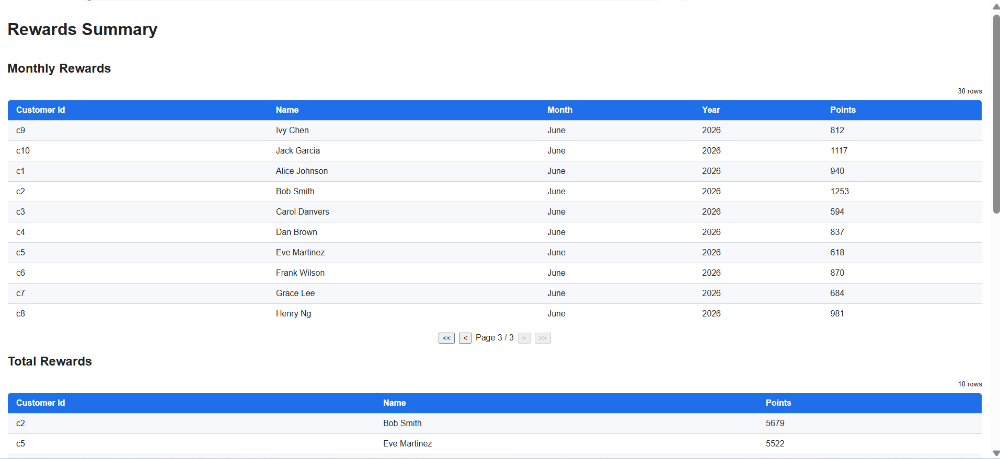
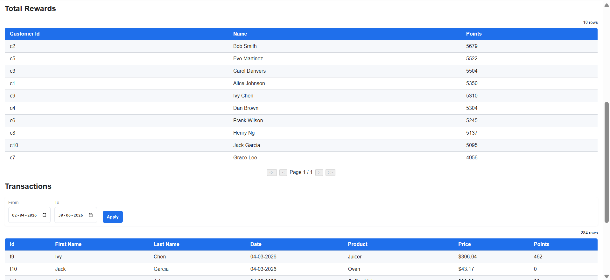
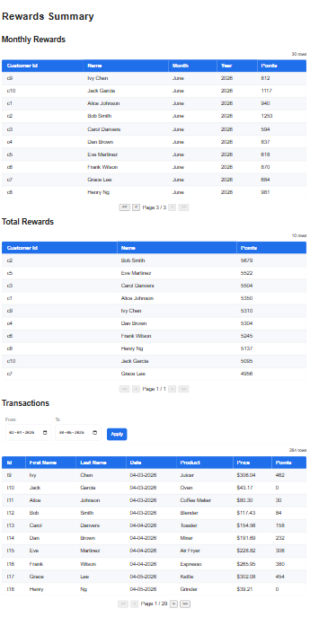
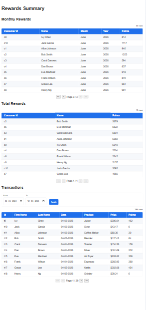

 # Rewards Application

A simple React application that demonstrates loading transaction data, transforming it with utility functions, and displaying the results in tabular views.

## Technologies

- React (functional components)
- Webpack + Babel
- Jest for unit tests
- ESLint for linting

## Quick start

1. Install dependencies:

```powershell
npm install
```

2. Start the development server:

```powershell
npm start
```

3. Run unit tests:

```powershell
npm test
```

4. Run linter:

```powershell
npm run lint
```

## Project structure (high level)

- `src/components/` – React components for tables and UI
- `src/services/` – simulated data/API helpers
- `src/utils/` – pure utility functions and business logic
- `src/styles/` – CSS and responsive helpers
- `src/tests/` – Jest unit tests

## Notes

- Sample data is available under `src/services/sampleData.js`.
- Utility functions are exportable and covered by unit tests.
- For responsive tables, wrap the table markup with the `.table-responsive` container.

## Screenshots
Below are the screenshots included in the `screenshots/` folder.

Desktop view:



Desktop view (alternate):



Mobile / narrow viewport (1):



Mobile / narrow viewport (2):




